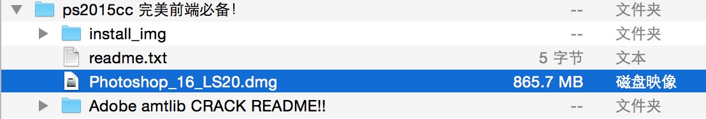
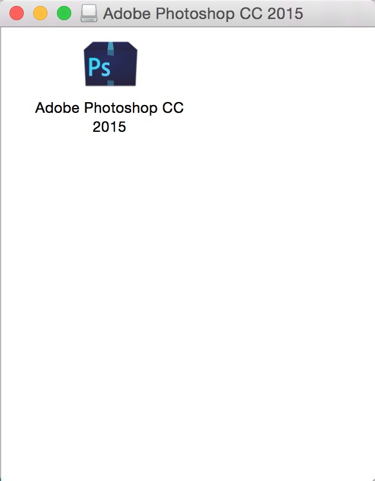

## 下载

下载步骤：

前往服务器`afp://172.21.0.196/`，账号：`developer`   密码：`hello1234`

进入`开发共享/mac常用软件`，下载`Photoshop 2015 CC附破解.zip`

## 安装步骤

1. 打开dmg文件

2. 断开网络
  

3. 双击Install.app，开始初始化
  
  
  

4. 初始化成功后，选择`试用`
  

5. 选择`登录`，再选择`以后登录`
  
  

6. `接受`协议后，开始`安装`
  
  

7. 需要输入本机的密码
  
  

8. `特别注意`：到这一步，安装已经完成了。先别点击`任何按钮`。`不要立即启动`。先进行下一步，`破解`
  

9. `破解`是最关键的一步，在`应用程序`里，找到刚刚安装的`Adobe Photoshop CC 2015.app`，点击`右键`，`显示包内容`。
  

10. 把破解文件`amtlib.framework`复制到`Contents/Frameworks` 文件中，并选择`替换`文件。
  

11. OK，大功告成。可以享用最新的PS了。
